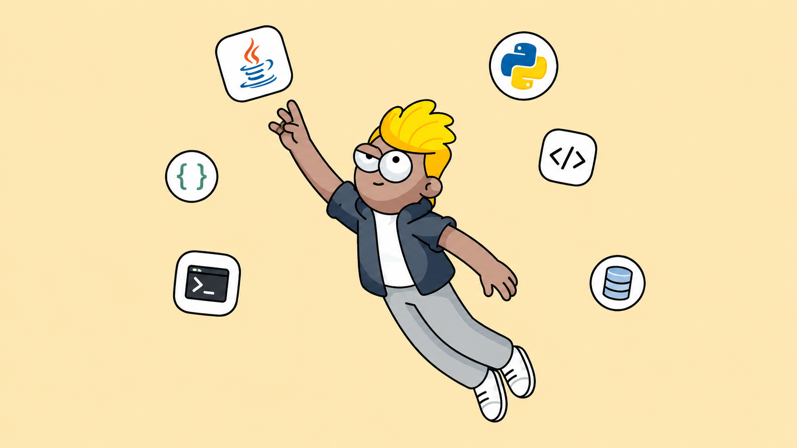

# Sketch to Motion

[English](README.md) | [简体中文](README.zh-CN.md)

## Colorful Version Demo

| Input image | Colorful drawing animation |
|:---:|:---:|
|  |  |

Generate it with the color pipeline:

```bash
python sketch2svg_color.py input.png 16
python render_color.py input_color.svg --duration 5.0 --delay 0.05 --scale 3.55 --output-file output
```

The color pipeline quantizes the image into up to 16 colors, traces each color layer separately with potrace, and renders a colored drawing animation with Manim. Generated SVGs include their own background color, so they can be moved or shared without a companion file.

Convert a static image into a smooth drawing animation using [Manim](https://www.manim.community/).

This project takes a doodle, photo, or sketch, converts it into an SVG vector graphic, and renders it into an animated MP4 video with Manim.  
It also prepends the last frame to the start of the video, creating a short pause for a more polished look.

---

## Features

- **Multi-scene project editor** with a draggable scene timeline
- Per-scene images, scripts, animation settings, voice status, and duration
- Provider-neutral TTS backend with VieNeu as the first Vietnamese provider
- SHA-256 TTS cache and sequential batch generation (`concurrency = 1`)
- Scene and full-project synchronized preview
- Project JSON save/load with migration from the original single-image shape
- H.264/AAC master export in 9:16, 16:9, or 1:1 at 720p/1080p and 30/60 FPS
- **Image → Sketch → SVG → Animated MP4**
- Adjustable animation parameters:
  - **Animation duration** (seconds)
  - **Subpath delay ratio** (fractional delay between subpaths)
  - **Scale factor** (zoom in/out)
  - **Drawing style** (`linear`, `smooth`, `there_and_back`, `wiggle`)
  - **Video format**: landscape 16:9 (`1920x1080`) or portrait 9:16 (`1080x1920`)
- High-quality vector rendering powered by Manim
- Optional color-preserving SVG and video generation
- Automatic last-frame prepend for a smooth intro
- Simple bilingual [Gradio](https://www.gradio.app/) web interface (English / Chinese)

---

## Installation

### 1. Clone this repository
```bash
git clone https://github.com/yourusername/sketch-to-motion.git
cd Sketch2Motion
```

### 2. Install Python dependencies

Make sure you have **Python 3.9+** installed.

```bash
pip install -r requirements.txt
```

Key dependencies:

* [Gradio](https://www.gradio.app/)
* [Manim](https://docs.manim.community/)
* [ffmpeg](https://ffmpeg.org/) (must be installed and in your PATH)
* [Potrace](https://potrace.sourceforge.net/) (must be installed and in your PATH)

Install Manim:

[Installing Manim](https://docs.manim.community/en/stable/installation/uv.html)

Install ffmpeg:

* **Windows**: [Download from official site](https://ffmpeg.org/download.html) and add `bin` folder to PATH
* **macOS**: `brew install ffmpeg`
* **Linux**: `sudo apt install ffmpeg` or use your package manager

Install Potrace:

* **macOS**: `brew install potrace`
* **Linux**: `sudo apt install potrace` or use your package manager

---

## Usage

### Launch the Gradio app

```bash
python app.py
```

Access the app at:

```
http://127.0.0.1:7880/studio/
```

The editor still supports the original one-image workflow: a new project starts
with one scene, so you can upload an image, generate its sketch, and preview it
without adding more scenes.

### VieNeu TTS bridge

Sketch2Motion does not load VieNeu in the Gradio process. Configure a local
VieNeu audio bridge in `.env` (see `.env.example`):

```env
VIENEU_TTS_URL=http://127.0.0.1:8001
VIENEU_TTS_VOICES_PATH=/voices
VIENEU_TTS_SYNTHESIZE_PATH=/synthesize
```

The bridge should return WAV/MP3 bytes, or JSON containing `audioUrl` or base64
audio. Sketch2Motion exposes its own backend endpoints:

```text
GET  /api/tts/voices
POST /api/tts/generate
```

VieNeu is registered for Vietnamese only. English remains an explicit provider
extension point; **No Voice** mode uses manual scene durations.

An SDK-backed bridge is included. Keep it in a separate environment so the
VieNeu model cannot consume the editor's memory:

```powershell
py -3.12 -m venv .venv-vieneu
.venv-vieneu/Scripts/python -m pip install -r requirements-vieneu.txt
.venv-vieneu/Scripts/python -m services.tts.vieneu_bridge
```

The local bridge defaults to VieNeu v3 Turbo and exposes all 20 built-in voices
across Northern, Central, and Southern accents. CPU uses the ONNX/int8 path by
default; set `VIENEU_DEVICE=cuda` to let VieNeu use its GPU path. The bridge also
supports legacy modes and the official remote mode through
`VIENEU_MODE=remote` and `VIENEU_REMOTE_API_BASE`. Voice enumeration remains
dynamic, so custom presets returned by a configured SDK/model also appear in
the editor after clicking **Refresh voices**.

### 3. Web interface workflow

1. Use the **Language / 语言** selector to switch between English and Chinese.
2. Upload a doodle/photo as the **Input image**. Enable **Preserve colors** to use the color pipeline and choose its palette size.
3. Click **Generate sketch** to convert it to SVG.
4. Adjust **Animation duration**, **Subpath delay ratio**, **Scale factor**, and **Drawing style**.
5. Choose the **Video format** (landscape is selected by default), then click **Generate video** to render and preview the animation.
6. Download the generated MP4.
